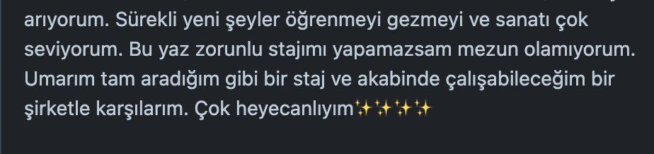

# 💻 Staj 2025

Başta zorunlu staj ihtiyacı olan öğrenci arkadaşlar ile stajyer almak isteyen değerli şirketlerimizi, startupları, ekipleri buluşturan yer.




## 📪 Staj Başvurusu

- Repoda bulunan **Issues** alanına tıklanır.
- Bu alandan **New Issue** butonuna basılır.
- **"Staj Başvuru Formu"** seçilir ve içindeki boş alanlar doldurulur.
- Burada format **şu şekilde olmak zorundadır**:  
  **AD-SOYAD [ALAN][STAJ YERİ][STAJ TİPİ][STAJ SÜRESİ]**
  
- **Alan** kısmı şu bilgilerden birini veya birden fazlasını içerebilir:  
  `["mobile", "backend", "frontend", "pm", "qa", "game", "data-science", "database", "embedded", "blockchain"]`
  
- **Staj Yeri** için şu seçeneklerden biri belirtilmelidir:  
  `["uzaktan", "yüzyüze"]`
  
- **Staj Tipi** için şu seçeneklerden biri belirtilmelidir:  
  `["zorunlu", "gönüllü"]`
  
- **Staj Süresi** için şu seçeneklerden biri belirtilmelidir:  
  `["4hafta", "6hafta"]`
  
- Bu bilgiler dışında başka bir format kabul edilmemektedir. Örneklere bakarak birden fazla giriş yapabilirsiniz.

> Yeni eklemeler duruma göre olacaktır. Önerisi olan label.json içinde ekleyip pr da atabilir.

## 📍 Örnek başvuru başlıkları

```yaml
Veli Bacik [pm,qa][uzaktan][zorunlu][4hafta]
Veli Bacik [mobile,backend][uzaktan][zorunlu][4hafta]
Veli Bacik [uzaktan][mobile,backend][zorunlu][4hafta]
Veli Bacik [pm,qa][mobile,backend][zorunlu][4hafta]
Veli Bacik4 [mobile,backend][uzaktan,zorunlu][yüzyüze][4hafta,6hafta]
Veli Bacik 3 [mobile][gönüllü][zorunlu,yüzyüze][4hafta,6hafta]
Veli Bacik 2 [mobile][uzaktan,gönüllü][zorunlu,yüzyüze][4hafta]
Veli Bacik [pm,qa,data-science][uzaktan][zorunlu][4hafta]
```

## 🤝 Katkıda Bulunma

### 📝 Yeni bir alan eklemek istersem ne yapmalıyım?

- Repo'dan bir clone alınır.
- Bu alanın içinde label.json içinde yer alan context ile aynı şekilde label tanımlamaları yapılır.
- Bu değişiklikler commit edilir.
- Pull request oluşturulur.
- Pull request kabul edilir.
- Yeni bir alan eklenecektir otomatik olarak.

### 📝 Staj fırsatları eklemek istersem ne yapmalıyım?

- Repo'dan bir clone alınır.
- [Staj fırsatları olan şirketler](usefull_company.md) açılır ve yeni şirket şablonu okunur.
- Bu şablona uygun şirketlerin bilgileri eklenir.
- Bu değişiklikler commit edilir.
- Pull request oluşturulur.
- Pull request kabul edildikten sonra usefull_company.md dosyasına yeni bir şirket eklenecektir.

## FAQ

#### Yeni issue açıyorum ama hemen kapanıyor ne yapsam oluşturamadım. Ne yapmalıyım?

- Bu durumun sebebi, issue formatının doğru olmamasıdır.(Noktalama işaretleri, boşluklar, kelimelerin doğru yazılması gibi)
- Lütfen issue formatını kontrol ediniz.
- Örnekleri inceleyebilirsiniz.

#### Formata uygun yapmazsam ne olur?

Açılan **issue**, formata uygun değilse otomatik olarak kapanacaktır.

#### Gönüllü staj yapmak istiyorum, başvurabilir miyim?

Evet, başvurabilirsiniz. Ancak önceliğimiz daima **zorunlu staj** yapması gereken arkadaşlar olacaktır.

#### İyi bir repom yok, bu bir sorun mu?

Öğrencilik döneminde olmamanız bir sorun değil. Ancak henüz zaman varken, bir alanda örnek bir repo hazırlamak çok değerli olacaktır. Bu noktada, [https://www.uplabs.com/](https://www.uplabs.com/) gibi platformlardan bir tasarım seçip, ister **backend**, ister **mobil**, isterseniz **frontend/web** olarak kodlayabilirsiniz.

Bu yazı bu konuda yardımcı olacaktır: [ilk-adımını-at-ekip-çalışmasıyla-proje-geliştirme-rehberi](https://medium.com/@vbacik-10/i̇lk-adımını-at-ekip-çalışmasıyla-proje-geliştirme-rehberi-1a794972e724)

# Geçmiş Dönemler

## 2024 
Yaklaşık 300+ arkadaşa bu repo ile bir imkan sağlamıştık. (Kapatılan)
https://www.linkedin.com/feed/update/urn:li:activity:7191692371082854401/

## 2023

Yaklaşık 100+ arkadaşa bu repo ile bir imkan sağlamıştık.
https://www.linkedin.com/posts/veli-bacik-345978a9_github-vb102023-staj-2023-yaz-d%C3%B6nemi-activity-7066365173573312512-xtiO/


## Authors

- [@vb10](https://www.github.com/vb10)

## Screenshots


